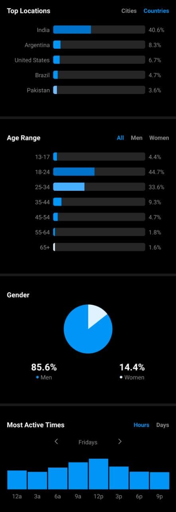

# TP Datos Personales: Insights de Instagram para cuenta de programación 
## Idea

* @codingroute
* 550+ seguidores
* 61 publicaciones a lo largo de 3 meses (enero, febrero y marzo 2021)

## Datos
Instagram ofrece distintos datos a cuentas de creadores de contenido desde la aplicación.

### Por cada publicación
* Likes
* Comentarios
* Cantidad de veces compartida
* Cantidad de veces guardado
* Acciones realizadas a partir de la publicación
* Cantidad de personas a las que le llegó la publicación (y que porcentaje de esas no son seguidores)
* Cantidad de personas que llegaron a través del perfil de la cuenta
* Cantidad de personas que llegaron a través de la página de inicio
* Cantidad de personas que llegaron a través de hashtags
* Cantidad de personas que llegaron de alguna otra forma
* Hashtags que tiene la publicación
* El pie de la foto

### De los seguidores

* Porcentaje de los top 5 países donde provienen 
* Porcentaje de los top 5 ciudades donde provienen 
* Porcentaje de las edades de todos los seguidores
* Porcentaje de las edades de todos los seguidores hombres
* Porcentaje de las edades de todos las seguidoras mujeres
* Porcentaje de hombres y mujeres entre los seguidores
* Cantidad de usuarios activos por cada rango de horas de cada día
* Cantidad de usuarios activos por cada día
* Que usuarios me siguen
* A que usuarios sigo
* A que usuarios conozco (marcado a mano)

## Almacenamiento de datos
Los datos fueron pasados a mano a una base de datos PostgreSQL. En el directorio data se encuentran todos los archivos .sql con los datos utilizados para la visualización

## Boceto de visualización
[Tableau Public](https://public.tableau.com/shared/BFRZCKJS4?:display_count=n&:origin=viz_share_link)

## Trabajo final
[Insights de Instagram](https://agustinroca.github.io/infovis/pdata/pdata)